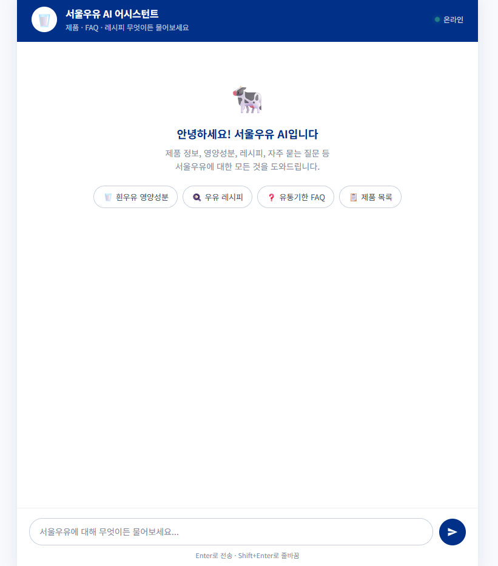
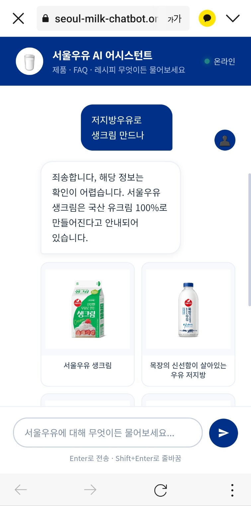
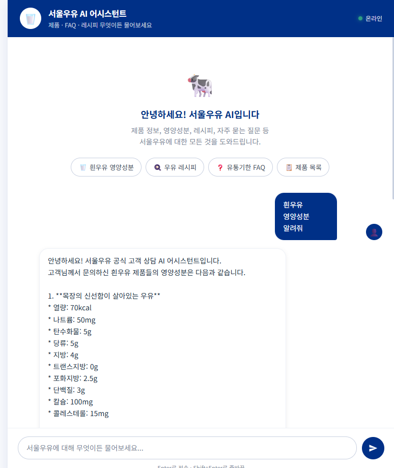
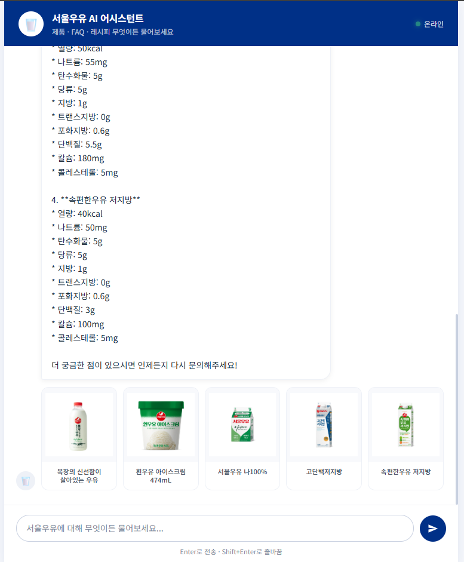
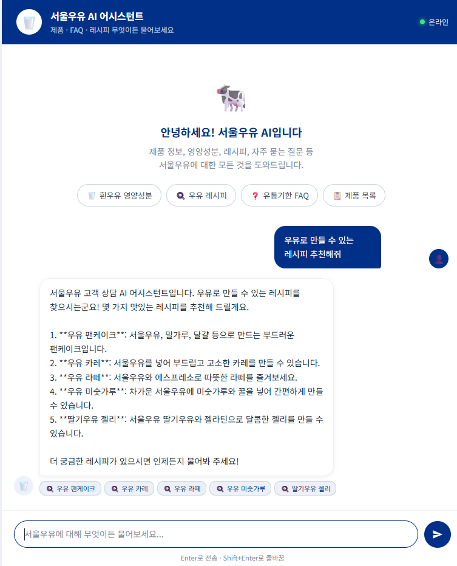

# 🥛 서울우유 RAG 챗봇

> 서울우유 제품 데이터를 기반으로 자연어 질문에 답하는 **RAG(Retrieval-Augmented Generation) 기반 AI 챗봇**  
> 데이터 수집부터 벡터 검색·LLM 연동·웹 배포까지 **1인 풀스택 구현**

[](https://seoul-milk-chatbot.onrender.com)
[](https://www.python.org/)
[](https://fastapi.tiangolo.com/)
[](https://ai.google.dev/)
[](https://www.trychroma.com/)


🔗 **배포 URL:** https://seoul-milk-chatbot.onrender.com  
📂 **GitHub:** https://github.com/shghd1515/seoul-milk-chatbot

> 💡 Render 무료 플랜 특성상 첫 접속 시 30초~1분의 cold start 시간이 소요될 수 있습니다.

---

## 📸 스크린샷

<table>
  <tr>
    <td width="50%">
      <b>메인 화면</b><br>
      
    </td>
    <td width="50%">
      <b>할루시네이션 방지</b><br>
      
    </td>
  </tr>
  <tr>
    <td width="50%">
      <b>제품 정보 답변 (1)</b><br>
      
    </td>
    <td width="50%">
      <b>제품 정보 답변 (2)</b><br>
      
    </td>
  </tr>
  <tr>
    <td colspan="2" align="center">
      <b>레시피 답변</b><br>
      
    </td>
  </tr>
</table>

---

## 📌 프로젝트 개요

### 문제 정의
일반 LLM에게 특정 기업의 제품을 질문하면 **부정확한 정보(할루시네이션)** 를 생성할 위험이 큽니다. 고객 상담 같은 비즈니스 환경에서는 이러한 부정확성이 브랜드 신뢰도에 치명적입니다.

### 해결 접근
**RAG(Retrieval-Augmented Generation)** 아키텍처로 접근했습니다. LLM이 답변 전에 **실제 기업 데이터베이스에서 관련 문서를 먼저 검색**하고, **검색된 문서만을 근거로 답변을 생성**하도록 강제합니다.

### 주요 성과
- ✅ **할루시네이션 방지 구조** — 시스템 프롬프트 + 검색 기반 컨텍스트 + 출처 노출의 3중 방어
- ✅ **153개 문서 임베딩 → 평균 응답 시간 약 2~3초**
- ✅ **월 ₩0 운영** — 무료 티어 조합으로 실사용 가능한 챗봇 배포
- ✅ **프로덕션 레벨 이슈 디버깅 경험** — 배포 환경에서만 발생하는 5가지 이슈를 로그 기반으로 추적·해결

---

## 🎯 이 프로젝트를 통해 증명하는 역량

| 역량 | 구체적 근거 |
|------|------------|
| **LLM/RAG 시스템 설계** | 임베딩·벡터 검색·LLM을 연결하는 end-to-end RAG 파이프라인을 직접 설계 및 구현 |
| **백엔드 개발** | FastAPI로 API 설계, Pydantic 타입 안전성 확보, 예외 처리 및 로깅 구조 설계 |
| **프론트엔드 개발** | 의존성 없는 Vanilla JS로 반응형 채팅 UI 구현, 동적 DOM 렌더링 |
| **데이터 파이프라인** | 크롤링 → 정제 → 청킹 → 벡터화 → 영속 저장까지 데이터 엔지니어링 전 과정 수행 |
| **클라우드 배포** | GitHub + Render 자동 배포 파이프라인 구축, 환경변수·시크릿 관리 |
| **트러블슈팅** | 로컬/배포 환경 차이로 인한 5가지 이슈를 **로그 기반으로 근본 원인 추적 후 해결** |
| **기술 선택 판단력** | 각 기술 스택의 선택 근거를 비용·성능·운영 난이도 관점에서 명확히 정리 |

---

## ✨ 주요 기능

| 기능 | 설명 |
|------|------|
| 🔍 **의미 기반 검색** | Gemini Embedding 벡터화 후 ChromaDB에서 코사인 유사도 기반 Top-5 문서 검색 |
| 🎯 **근거 기반 답변** | 검색된 문서만을 컨텍스트로 Gemini 2.5 Flash가 답변 생성 |
| 🖼️ **상품 카드 표시** | 답변 하단에 관련 제품 이미지·이름을 카드 그리드 형태로 노출 |
| 💬 **멀티턴 대화** | 최근 6턴 히스토리를 유지하여 맥락 있는 대화 |
| 📎 **출처 투명성** | FAQ·레시피 출처를 태그로 명시하여 답변 검증 가능 |
| 📱 **반응형 UI** | 모바일·데스크탑 모두 지원하는 채팅 인터페이스 |

---

## 🏗️ 시스템 아키텍처

```
┌────────────────────────────────────────────────────────────────┐
│                     사용자 (브라우저)                          │
│                          │                                      │
│                          │  HTTPS                                │
└──────────────────────────┼──────────────────────────────────────┘
                           ▼
┌────────────────────────────────────────────────────────────────┐
│                 FastAPI 서버 (Render)                           │
│                                                                 │
│   [POST /api/chat]                                              │
│         │                                                       │
│         ▼                                                       │
│   ┌─────────────┐                                               │
│   │  Retriever  │                                               │
│   │             │                                               │
│   │  1) 질문 임베딩                                              │
│   │  2) ChromaDB 유사도 검색 (Top-5)                             │
│   │  3) 컨텍스트 + 히스토리 구성                                  │
│   │  4) Gemini 2.5 Flash 호출                                   │
│   │  5) 출처 메타데이터 추출                                      │
│   └─────────────┘                                               │
│         │                                                       │
│         ▼                                                       │
│   {answer, sources[{image_url, label, ...}]}                   │
└────────────────────────────────────────────────────────────────┘
                           │
                           │  (오프라인 1회 구축)
                           ▼
┌────────────────────────────────────────────────────────────────┐
│                  데이터 파이프라인                              │
│                                                                 │
│  ┌──────────┐   ┌──────────┐   ┌─────────────┐   ┌──────────┐ │
│  │ Crawler  │──▶│  청킹    │──▶│   Gemini    │──▶│ ChromaDB │ │
│  │(BS4)     │   │(500자)   │   │  Embedding  │   │(Persist) │ │
│  └──────────┘   └──────────┘   └─────────────┘   └──────────┘ │
│      ↓                                                           │
│   products/                                                      │
│   faq/                                                           │
│   recipes                                                        │
└────────────────────────────────────────────────────────────────┘
```

### 데이터 흐름 (Request Lifecycle)

1. **사용자 질문 입력** → `POST /api/chat` 호출 (message + history)
2. **질문 임베딩** → Gemini Embedding으로 쿼리 벡터 생성
3. **벡터 검색** → ChromaDB에서 코사인 유사도 기준 Top-5 문서 조회
4. **컨텍스트 구성** → 검색된 문서 + 최근 6턴 히스토리 + 시스템 프롬프트 병합
5. **LLM 호출** → Gemini 2.5 Flash에 컨텍스트 전달 (max_tokens=4096)
6. **출처 메타데이터 추출** → 검색 결과 metadata에서 상품 이미지·이름·URL 추출
7. **응답 반환** → `{answer, sources}` JSON으로 프론트엔드에 전달

---

## 🛠️ 기술 스택 및 선택 근거

### LLM: **Google Gemini 2.5 Flash**
- 무료 티어 제공 (분당 15회, 일 1,500회)로 학습·배포 부담 없음
- 한국어 자연어 처리 품질 우수
- Flash 모델 특성상 응답 속도가 빠름(평균 1~2초)

### 임베딩: **`gemini-embedding-001`**
- LLM과 동일 프로바이더로 API 관리 일원화
- 한국어 의미 표현 성능이 뛰어남
- LLM과 같은 API 키로 호출 가능

### 벡터 DB: **ChromaDB (Persistent Client)**
- **Pinecone/Weaviate 같은 클라우드 DB는 월 과금 발생** → 무료 배포에 부적합
- 로컬 파일(SQLite) 기반이라 Git에 포함하면 배포 시 별도 인프라 불필요
- 수만 청크 규모까지는 성능 충분, Python 네이티브 API로 개발 편의성 높음

### 백엔드: **FastAPI + Uvicorn**
- Pydantic 기반 자동 타입 검증·문서화
- 비동기 지원으로 확장성 확보
- `/docs` 자동 생성되어 API 테스트 편리

### 프론트엔드: **Vanilla JavaScript + HTML/CSS**
- React 등 프레임워크는 이 규모의 단일 페이지엔 과도
- 번들링 과정 없이 즉시 배포 가능, 로딩 속도 빠름
- CSS Grid로 상품 카드 반응형 레이아웃 구현

### 배포: **Render (무료 플랜)**
- GitHub 연동 자동 배포
- HTTPS 기본 제공
- 환경변수 관리 UI 제공
- `render.yaml`로 Infrastructure as Code 실현

---

## 📂 프로젝트 구조

```
seoul-milk-chatbot/
├── crawling/
│   ├── crawler.py            # 서울우유 홈페이지 크롤러 (제품·FAQ·이미지 URL)
│   └── data/
│       ├── products.json     # 제품 80건 (카테고리·영양성분·이미지)
│       ├── faq.json          # FAQ 65건
│       └── recipes.json      # 우유 활용 레시피 8건
├── rag/
│   ├── embedder.py           # 청킹 → Gemini 임베딩 → ChromaDB 저장
│   └── retriever.py          # 벡터 검색 + LLM 호출 + 출처 메타데이터 구성
├── static/
│   └── index.html            # 싱글 페이지 채팅 UI (Vanilla JS)
├── docs/                     # 스크린샷·시연 GIF
├── chroma_db/                # 벡터 DB 영속 저장소 (배포 포함)
├── app.py                    # FastAPI 엔트리포인트
├── requirements.txt          # 의존성 (버전 핀)
├── render.yaml               # Render 배포 설정 (IaC)
├── .env.example              # 환경변수 템플릿
├── .gitignore
└── README.md
```

---

## 🚀 로컬 실행 방법

### 1. 저장소 클론
```bash
git clone https://github.com/shghd1515/seoul-milk-chatbot.git
cd seoul-milk-chatbot
```

### 2. 의존성 설치
```bash
pip install -r requirements.txt
```

### 3. 환경변수 설정
[Google AI Studio](https://aistudio.google.com/app/apikey)에서 API 키 발급 후:
```bash
cp .env.example .env
# .env 파일에 GEMINI_API_KEY=your_key_here 입력
```

### 4. 데이터 파이프라인 실행
```bash
python crawling/crawler.py      # 크롤링 → JSON 저장
python rag/embedder.py          # 임베딩 → ChromaDB 저장
```

### 5. 서버 실행
```bash
python app.py
```

브라우저에서 `http://127.0.0.1:8000` 접속

---

## 📡 API 명세

### `POST /api/chat`
자연어 질문을 받아 RAG 기반 답변과 출처를 반환합니다.

**Request**
```json
{
  "message": "흰우유 영양성분 알려줘",
  "history": [
    {"role": "user", "content": "이전 질문"},
    {"role": "assistant", "content": "이전 답변"}
  ]
}
```

**Response**
```json
{
  "answer": "서울우유 흰우유 200ml 기준 영양성분은...",
  "sources": [
    {
      "type": "product",
      "label": "목장의 신선함이 살아있는 우유",
      "image_url": "https://m.seoulmilk.co.kr/...",
      "url": "https://m.seoulmilk.co.kr/..."
    }
  ]
}
```

### `GET /api/health`
서비스 상태 확인용 헬스체크 엔드포인트

---

## 🐛 트러블슈팅 경험

배포 과정에서 실제로 겪은 5가지 이슈와 해결 과정입니다. 각 문제는 **근본 원인을 로그 기반으로 추적**하여 해결했습니다.

### 1️⃣ 임베딩 모델 불일치로 인한 검색 실패

**증상:** RAG 검색 결과가 엉뚱한 문서만 반환되어 답변 품질 저하.

**원인 분석:** `embedder.py`는 `gemini-embedding-001`로 문서를 벡터화했는데, `retriever.py`는 `text-embedding-004`로 쿼리를 벡터화하고 있었음. **임베딩 공간이 다르면 의미 유사도 계산이 무의미**해짐.

**해결:**
- 양쪽 모듈이 **동일한 `GeminiEmbeddingFunction` 클래스**를 import해서 사용하도록 리팩토링
- `EMBEDDING_MODEL` 상수를 한 곳에서만 정의하여 변경 시 자동 동기화

**인사이트:** RAG 시스템에서 **index 시점과 query 시점의 임베딩 모델은 반드시 동일**해야 하며, 이를 **코드 레벨에서 강제**하는 구조를 설계해야 휴먼 에러를 방지할 수 있다.

---

### 2️⃣ NumPy 2.0 호환성 이슈 (배포 전용 버그)

**증상:** 로컬에서는 정상 동작. Render 배포 시 빌드는 성공했으나 런타임에 `AttributeError: np.float_ was removed in the NumPy 2.0 release`로 서버 시작 실패.

**원인 분석:** `chromadb==0.5.0`이 NumPy 1.x API에 의존하는데, `requirements.txt`에 NumPy 버전이 고정되어 있지 않아 pip가 자동으로 최신 2.x를 설치. 로컬에는 이미 NumPy 1.x가 설치되어 있어 문제 없었음.

**해결:**
```
# requirements.txt
numpy<2.0
```

**인사이트:** 의존성 라이브러리의 **간접 의존성(transitive dependency)까지 명시적으로 관리**해야 배포 환경의 재현성이 보장된다. 로컬 성공이 배포 성공을 보장하지 않는다.

---

### 3️⃣ Google API 키 유출 감지 → 자동 차단

**증상:** 배포 직후 첫 요청에서 `403 PERMISSION_DENIED: Your API key was reported as leaked` 에러.

**원인 분석:** 초기 커밋에 `.env` 파일이 포함되어 GitHub 공개 저장소에 API 키가 노출되었고, **Google의 자동 스캔 시스템이 감지하여 즉시 키를 차단**함.

**해결 과정:**
1. Git 히스토리에서 `.env` 완전 제거 (`.git` 폴더 삭제 → 재초기화 → force push)
2. `.gitignore`에 `.env` 명시적 추가
3. 기존 API 키 폐기 후 신규 발급
4. Render 환경변수에 신규 키 등록하여 재배포

**인사이트:** **시크릿 관리는 프로젝트 초기부터 확립**되어야 한다. 한 번 유출되면 `git rm --cached` 만으로는 부족하며, **히스토리 전체를 정리하고 키를 로테이션**해야 한다. 이후 프로젝트에서는 `pre-commit hook`이나 `git-secrets` 도구 도입을 고려할 만하다.

---

### 4️⃣ ChromaDB `_decode_seq_id` 버그 (플랫폼별 호환성)

**증상:** 로컬(Windows)에서는 정상이지만 Render(Linux)에서만 쿼리 시 `TypeError: object of type 'int' has no len()` 에러 발생.

**디버깅 과정:**
1. 초기 Render 로그에는 `500 Internal Server Error`만 찍히고 스택 트레이스 없음
2. **FastAPI 예외 핸들러에 `traceback.print_exc()` 추가**하여 전체 스택 트레이스 확보
3. 스택 트레이스로 원인이 ChromaDB 내부 `_decode_seq_id` 함수임을 확인
4. GitHub Issues 검색으로 `chromadb==0.5.0`의 **알려진 버그**이며 `0.5.23`에서 수정됨을 확인
5. `chromadb==0.5.23`으로 업그레이드, 로컬에서 DB 재생성 후 재배포

**해결 코드:**
```python
# app.py - 트러블슈팅을 위한 로깅 강화
@app.post("/api/chat")
def chat(req: ChatRequest):
    try:
        result = retriever.answer(req.message, history=req.history)
        return ChatResponse(...)
    except Exception as e:
        print("=" * 60, flush=True)
        traceback.print_exc()  # ← Render 로그에 전체 스택 출력
        print("=" * 60, flush=True)
        raise HTTPException(status_code=500, detail=f"{type(e).__name__}: {e}")
```

**인사이트:** **관찰 가능성(Observability)은 프로덕션 디버깅의 생명선**이다. 환경 차이로 발생하는 버그는 로그 없이는 해결 불가능하며, FastAPI의 기본 예외 처리에 의존하지 말고 **명시적 스택 트레이스 로깅**을 초기부터 넣어야 한다.

---

### 5️⃣ LLM 응답 토큰 초과로 인한 답변 잘림

**증상:** 여러 제품을 나열하는 긴 답변에서 응답이 문장 중간에 끊김.

**원인 분석:** `max_output_tokens=1024`로 설정된 출력 토큰 제한이 실제 답변 길이보다 짧았음.

**해결:** 토큰 한도 확장과 프롬프트 엔지니어링을 **병행**하여 근본 원인 해결.
```python
config={"temperature": 0.3, "max_output_tokens": 4096}
```

시스템 프롬프트에도 간결성 규칙 추가:
> "답변은 핵심만 간결하게, 목록은 최대 5개까지만 보여주고 더 궁금한 게 있으면 물어보라고 안내해."

**인사이트:** LLM 기반 시스템에서는 **토큰 파라미터 튜닝과 프롬프트 엔지니어링이 동시에 진행**되어야 한다. 단순히 한도만 늘리면 비용 증가, 단순히 프롬프트만 고치면 여전히 잘릴 수 있다.

---

## 📊 성능 및 비용 분석

### 응답 시간 (평균)

| 단계 | 소요 시간 |
|------|----------|
| 쿼리 임베딩 | ~200ms |
| ChromaDB 검색 | ~50ms |
| Gemini LLM 호출 | 1.5~2.5s |
| **전체 응답** | **약 2~3초** |

> ⚠️ Render 무료 플랜의 cold start 시 첫 요청은 30초~1분 추가 소요

### 데이터 규모

| 항목 | 수량 |
|------|------|
| 수집 제품 | 80건 |
| 수집 FAQ | 65건 |
| 레시피 | 8건 |
| **총 청크 수** | **153개** |
| ChromaDB 용량 | 약 3MB |

### 월간 운영 비용

| 구성 | 무료 티어 | 실서비스 가정 (일 1,000 대화) |
|------|----------|-----------------------------|
| Gemini API | ₩0 (일 1,500회 한도) | 약 ₩5,000~15,000 |
| Render 인프라 | ₩0 (750h/월) | 약 ₩10,000 (Starter) |
| **합계** | **₩0** | **약 ₩15,000~25,000** |

> 현재 MVP는 완전 무료로 운영 중. 실서비스 확장 시에도 소규모 트래픽에서는 월 2~3만원 수준으로 경제성 확보 가능.

---

## 🔮 향후 개선 로드맵

### Phase 1: 사용자 경험 개선 (1~2주)
- [ ] **스트리밍 응답** — Gemini 스트리밍 API + SSE로 ChatGPT 스타일 타이핑 효과 구현
- [ ] **세션별 대화 저장** — localStorage 또는 Redis로 새로고침 시 히스토리 유지
- [ ] **피드백 수집 UI** — 답변마다 👍/👎 버튼, 개선 데이터 축적

### Phase 2: 운영 자동화 (1~2개월)
- [ ] **GitHub Actions CI/CD** — 주 1회 자동 크롤링 → 재임베딩 → 배포
- [ ] **관리자 대시보드** — 질문 통계, 답변 못한 질문 로그, 피드백 통계
- [ ] **Sentry 연동** — 프로덕션 에러 실시간 모니터링
- [ ] **A/B 테스트** — 프롬프트 버전별 답변 품질 비교

### Phase 3: 기능 고도화 (3개월+)
- [ ] **상담원 에스컬레이션** — 챗봇이 답하지 못하는 문의를 실제 상담원에게 전달
- [ ] **멀티모달** — 사용자가 제품 사진 업로드 시 해당 제품 정보 안내
- [ ] **개인화 추천** — 과거 대화 기반 맞춤형 레시피·제품 추천
- [ ] **하이브리드 검색** — Dense vector + Sparse(BM25) 검색 결합으로 검색 품질 향상

---

## 📄 라이선스

MIT License

## 🙋‍♂️ Contact

- **GitHub:** [@shghd1515](https://github.com/shghd1515)
- **Live Demo:** https://seoul-milk-chatbot.onrender.com

---

> ⚠️ 이 프로젝트는 개인 학습 및 포트폴리오 목적으로 제작되었으며, 서울우유협동조합과 공식적인 제휴 관계가 없습니다. 데이터는 서울우유 모바일 홈페이지에서 학습 목적으로 수집하였습니다.
